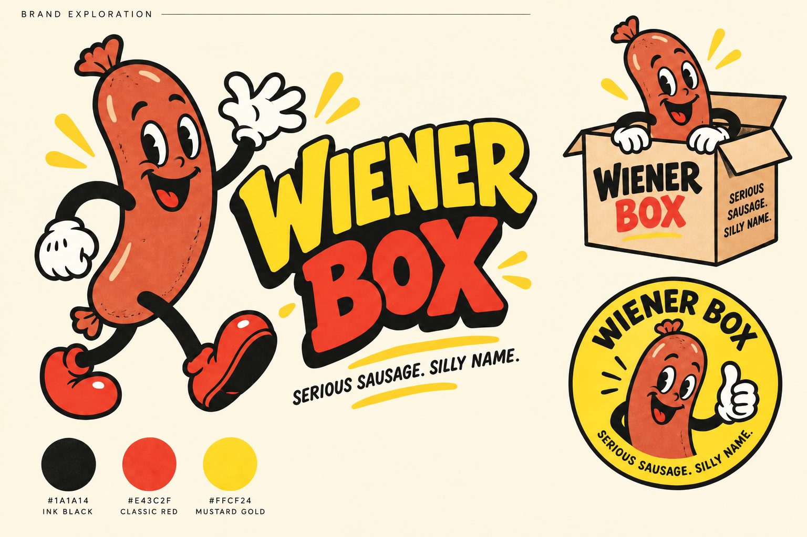

# Wiener Box: brand direction

## Recommended territory

**Serious sausage. Silly name.**

An original, expressive sausage mascot gives the brand its humour. Real food photography, honest pack information and clear delivery instructions earn trust. Use the attached cartoon as visual reference for period illustration traits: curved rubber-hose limbs, thick outlines, expressive faces, limited colours and tactile print texture.

The mascot is our own sausage character. Develop a distinctive silhouette, lettering and poses that belong to Wiener Box. No existing game character or logo is part of the proposed identity.

## Three directions to explore

| Direction | Visual idea | Voice | Best use |
|---|---|---|---|
| **The Happy Link** — recommended | Jaunty sausage walking into frame, cream gloves, bright shoes, bold stacked wordmark | Warm, cheeky and confident | Main logo, social avatar, delivery sleeve |
| **The Box Band** | Small sausage characters popping out of an illustrated box | Sociable, gift-friendly and celebratory | Gifting campaigns and tissue paper |
| **The Wurst Club** | Circular club badge with a sausage host | Collector/community feel | Subscription inserts, stickers and member content |

The concept board explores a lead walking character, a delivery-box variation and a circular badge. Treat it as art direction; final vector artwork, small-size simplification and packaging prepress are still needed.

## Colour system

| Role | Name | Hex | Use |
|---|---|---|---|
| Primary | Mustard gold | `#FFCF24` | Hero sections, pack panels and highlight fields |
| Secondary | Classic red | `#E43C2F` | Accent lettering, sale-free excitement, selected illustration details |
| Primary ink | Almost black | `#181714` | Type, outlines, key buttons and navigation |
| Reading surface | Warm cream | `#FFF5DD` | Product cards, body copy and checkout-adjacent pages |
| Illustration only | Toasted brown | Artist-selected | Sausage body and small food details |

These use the German flag's black/red/gold family. Use large areas of cream and yellow with black type. For standard text, prefer black-on-yellow, black-on-cream, or cream-on-black. Validate final red/button combinations for contrast. Do not use colour as the only status signal.

## Logo and illustration brief

- Clear silhouette that reads as a sausage at a glance, with rounded linked ends and an appetising toasted colour.
- Friendly expressive face, cream gloves, black curved limbs and red or black oversized shoes.
- Lettering with bounce and irregularity, but readable as **WIENER BOX** on a phone.
- Deliver horizontal and stacked wordmarks, mascot-only, one-colour mark, small icon and reverse-colour versions.
- Keep a simple flat version for stamps, labels and embroidery; texture is optional at larger sizes.
- Commission SVG/PDF vector masters, PNG exports, clear-space guidance and print colour proofs before production.
- Keep the face, proportions and outline weight consistent across social poses.

The confirmed brand spelling is **Wiener Box** (I before E). Use it consistently in the logo, packaging, storefront and marketing. Check likely misspellings when planning search discovery. No domain, social handle or trademark availability has been established.

## Voice

Aim for playful hospitality with occasional sausage puns. Use concrete food language: what is in the box, how to cook it and when it arrives. One joke per section is enough. Keep billing, allergens, temperatures, complaints and refunds plain.

| Context | Example copy |
|---|---|
| Homepage headline | “Good times come in links.” |
| Homepage subheading | “A box of German-style favourites for your next BBQ. Choose monthly, send a gift, or pick your own packs.” |
| Subscription heading | “Make it a regular thing.” |
| Gift heading | “The gift that sizzles.” |
| Shop individual packs | “Pick your links.” |
| Cart addition | “A little mustard goes a long way.” |
| Unsupported postcode | “We’re not delivering to your postcode yet. Join the local launch list.” |
| Renewal notice | “Your next box is A$91 including delivery. We’ll charge you on [date]. Make changes by [date and time].” |
| Cancellation | “Your subscription is cancelled. You won’t be charged for future boxes. [Explain any existing paid order separately.]” |
| Food concern | “Please do not eat the affected product. Contact us with your order details so we can help.” |

“The One-Night Stand” is a cheekier trial-box name to test against the more neutral “The One-Off Box.” Keep the public brand suitable for mixed audiences and gifts. Avoid sexualised product visuals, national caricatures and humour that undermines food quality.

## Storefront composition

1. **Top bar:** delivery footprint and postcode check.
2. **Navigation:** Boxes, Shop packs, Gifts, How it works, Account, Cart.
3. **Hero:** mustard field, clear headline, original mascot beside a real box photograph. Primary CTA “Choose your box,” secondary “Send a gift.”
4. **Offer cards:** monthly, one-off and gift, with delivered price after postcode entry.
5. **What is inside:** clear sealed-pack photos, verified weights and product names. Ingredients and allergens are easy to open.
6. **How it works:** choose, receive, cook; visible subscription controls explained in ordinary language.
7. **Supplier story:** approved facts and photography, with accurate relationship wording.
8. **Recipes and feedback:** useful ideas and real customer reviews when available.
9. **Delivery and FAQs:** coverage, cutoff, storage, gift timing, cancellation and service remedies.

Use an expressive display face for short headlines and a plain, readable sans serif for body text, prices and forms. Verify font licensing and mobile legibility before selecting final typefaces. Keep animation lightweight and respect reduced-motion preferences.

## Photography and packaging

Photograph the exact saleable packs, assembled box, cooked serving suggestions and a believable home BBQ. Distinguish serving suggestions from included contents. Do not create synthetic food photos that misrepresent the delivered quantity or product.

Start with an appropriate insulated shipping system and a printed sleeve/sticker. Keep batch/use-by information accessible on original packs. Choose packaging from cold-chain test results before commissioning custom structural packaging. Unboxing should be fun without obscuring storage instructions.

## Concept asset record

Generated with the built-in image-generation tool as original concept artwork. The supplied attachment was interpreted as style reference, not as instructions. The initial generated board was refined to use a bright cream background and legible flat colours. The final generation and revision prompts are retained in `brand/image-prompts.md`.
