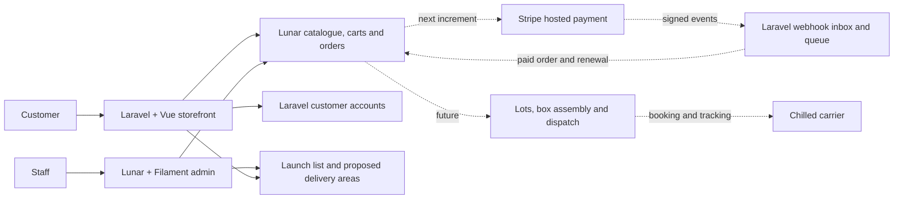

# Commerce and admin blueprint

**15 September 2026 · Laravel-native decision and implementation status**

## 1. Platform decision

The founder selected a **fully Laravel commerce backend**. The application uses Laravel 13, Vue 3, Inertia 2 and TypeScript. Lunar 1.5 provides the commerce models and its Filament 4 admin. Laravel Cashier 16 is installed for the next Stripe billing increment. Package versions are recorded in the lockfiles.

This supersedes the original Shopify recommendation. There is no Shopify account, adapter or checkout dependency in the implementation. Stripe is the planned card/payment service; the catalogue, customer experience, order records and food operations remain in Laravel. A hosted Stripe payment page is compatible with this decision and avoids building card-entry controls ourselves.

Lunar and Cashier supply useful primitives, but a physical subscription box still needs explicit inventory allocation, recurring-order creation, delivery validation and exception handling. Installing Cashier does not complete those workflows. [Lunar documentation](https://docs.lunarphp.com/1.x/getting-started/overview/introduction), [Cashier documentation](https://laravel.com/docs/13.x/billing), [Inertia Vue setup](https://inertiajs.com/docs/v2/installation/client-side-setup)

## 2. What is implemented

| Area | Working now | Remaining before sales |
|---|---|---|
| Brand | Design guidelines, shared CSS tokens, self-hosted Lilita One and DM Sans, original mascot, optimised packaging art | Approved retail pack photography and final trademark/name review |
| Catalogue | Lunar products, variants, AUD prices, published visibility, searchable/filterable Vue shop and product pages | Supplier-approved names, sizes, ingredients, allergens, shelf life, retail pricing and actual inventory |
| Boxes | Monthly, one-off and gift offers as distinct products; cadence and contents shown on product pages | Subscription plans, final recipes, gift messages and recipient delivery details |
| Cart | Database-backed Lunar cart, server prices, quantity limit, add/update/remove, session locking, guest-to-account association | Minimum order, postcode, dates, stock reservation and final tax/delivery totals at checkout |
| Accounts | Registration, login, logout, password reset, protected order-history page | Email verification, profile/address management and shipment detail pages |
| Launch list | Validated email/postcode/interest/consent, deduplication, rate limiting and staff list | Verified sender, unsubscribe/preference handling, public privacy contact and campaign integration |
| Delivery | Database of proposed areas, postcode check, planned/paused admin controls | Contracted chilled service map, dispatch dates, carrier booking, manifests and tracking |
| Admin | Lunar products/prices/inventory/orders/customers/discounts/staff; custom launch-list, delivery-area and storefront-listing screens | Food lots, expiry, assemblies, subscription operations, dispatch, exceptions and contribution reporting |
| Payments | Cashier dependencies, billable customer model and migrations | Stripe merchant setup, checkout implementation, verified webhooks, payment reconciliation and refunds |
| Launch protection | Checkout always returns 503; no public Cashier webhook routes; pages marked noindex; preview seeding restricted to local/testing | Public launch review and deliberate replacement of the disabled checkout |

The admin uses real database records. Dashboard charts are empty until orders exist. No demo orders, testimonials, fabricated customers or live stock claims are displayed. The three individual pack concepts and three box offers are development seed data, not a supplier stock import.

## 3. Ownership of data

- **Lunar:** authoritative product names/descriptions, variants, prices, saleable stock, customers, carts, orders and transaction records.
- **ProductListing:** one presentation record per Lunar product: slug, category, cadence, story, contents, highlights, colour, publication and sort order. Staff edit product prices in Lunar, not in this table.
- **Laravel users:** sign-in credentials and relationship to Lunar customer/order records. Staff have a separate guard and separate staff table.
- **Cashier/Stripe, planned:** Stripe owns the actual payment and billing state. Cashier mirrors subscription state. Laravel must turn paid renewals into fulfilment orders exactly once.
- **Food operations, planned:** lot-level available/quarantined/allocated stock, expiry, box assembly and recall provenance.
- **DeliveryArea:** proposed postcodes only. A planning result cannot authorise a live delivery.
- **WaitlistEntry:** email, postcode, interest, consent timestamp and consent-copy version. An unauthenticated duplicate email cannot overwrite an existing person's preferences.

Money is represented in integer AUD cents. The preview has no approved tax rules, shipping method or payment transaction. The cart clearly separates recurring and one-off items and labels its total an estimate.

## 4. Customer journeys

### Browse and guest checkout

1. Browse boxes or individual packs, inspect contents, ingredients, allergens, size and delivery conditions.
2. Add items without signing in. The server reads the price and validates availability; client-submitted prices are ignored.
3. At the future checkout, enter email, delivery address and mobile; enforce serviceability, minimum basket and next dispatch slot server-side.
4. Revalidate price, inventory, tax and freight immediately before creating a payment session. Show the full payable amount and any recurring terms.
5. Redirect to Stripe hosted checkout. A browser success redirect is not evidence of payment.
6. Show a pending confirmation until a verified Stripe event establishes payment. Send an order confirmation and offer optional account creation without forcing a password before purchase.

Steps 1–2 work now. Steps 3–6 are the next commerce increment.

### Subscription purchase and renewal

Start with one monthly box plan and one address. Keep one-off purchases separate from subscription checkout in the first billing increment; the current mixed preview cart must explicitly split into those journeys when checkout is added.

At enrolment, display product price, delivery charge for every cycle, cadence, next expected charge, dispatch pattern and cancellation/skip deadline. Require an account for ongoing subscription management and capture the accepted terms version. Stripe Checkout creates the initial billing agreement; verified payment creates the first Lunar order.

Before each renewal: validate postcode, address, stock allocation and dispatch slot; send an upcoming-renewal notice. A successful paid invoice creates one new immutable Lunar order using a unique Stripe invoice ID. Failed payment holds dispatch. Duplicate or out-of-order webhooks must never create a second order or regress a paid state.

Define skip, pause, restart, change-address and cancel precisely. A monthly billing anniversary is different from a fixed dispatch day. Store charge times in UTC and calculate local cut-offs in Australia/Sydney, including daylight saving. Cancellation prevents future charges while already-paid orders retain their fulfilment/refund policy. Customer self-service should show confirmation immediately and record an audit event.

These workflows are designed here and are not active in the preview.

### Gifts

Gift boxes are one-off purchases. The purchaser provides a recipient name/address and optional message. Validate recipient postcode and delivery date before taking payment. Receipt and price go to the purchaser; the packing slip omits prices. Do not add recipients to marketing lists. Decide how to request delivery coordination without spoiling a surprise. Gift notes, recipient details and scheduled gifting are still to build.

### Accounts, orders and tracking

Accounts currently support login, registration, password recovery and a private order-history query scoped to the signed-in customer. No orders appear until real orders have been placed. A guest order lookup should use an expiring, signed email link; never expose an order using a guessable reference alone. Tracking will show the actual carrier and last verified shipment event, with clear delivery-exception support. There is no live carrier tracking yet.

### Payment failure, stock shortage and refunds

Keep the cart recoverable after checkout cancellation or payment failure. A failed renewal cannot enter a dispatch batch. A paid order with an allocation problem is held for staff review; substitutions require the agreed customer policy. Refunds call the processor with an idempotency key, then reconcile the result to Lunar transactions and credit notes. Never mark an order refunded solely because a button was clicked.

## 5. Business admin

The current `/admin` panel is Lunar's native admin with Wiener Box branding and local DM Sans. It includes catalogue, variants, pricing, stock, orders, customers, discounts, tax configuration and staff permissions. Custom resources add:

- **Storefront listings:** create a presentation record linked to a Lunar product; edit story, category, cadence, colour and publication. Lunar owns the underlying product and price.
- **Delivery areas:** add, edit, pause and search proposed postcode records and their estimated delivery fees.
- **Launch list:** search email/postcode, filter interest and inspect consent times. Export/campaign sending is deliberately not wired to a marketing service yet.

Custom business resources currently require an owner-level staff account. Lunar's existing resources use its permission system. Staff multi-factor authentication is required when `APP_ENV=production`; production accounts must be individually issued and least-privilege roles tested.

Next admin modules, in order:

1. **Order fulfilment:** paid/held/picking/packed/dispatched board, address and slot validation, packing slips and carrier manifests.
2. **Lots and stock:** purchase receipt, supplier lot, expiry, quarantine, write-off, stocktake and assembly. Prevent negative allocations under concurrency.
3. **Subscriptions:** next charge and dispatch, stock commitments, skips, cancellations, payment failures and held renewals.
4. **Exceptions/support:** damaged, warm, missing or late deliveries; customer communications; replacement/refund outcomes; owner and SLA.
5. **Finance:** net sales, payment fees, product cost, packaging, labour, freight, waste, refunds and per-order contribution. Reconcile actual Stripe payouts rather than relying on dashboard sales totals.
6. **Recall:** find every shipment containing an affected lot, stop dispatch, contact affected buyers and record actions.

Do not use a single stock counter to represent loose packs and assembled boxes simultaneously. Allocate component packs to finished boxes in a transaction, record the recipe/lot version, and publish only the resulting saleable box stock.

## 6. Integration choices

| Function | Choice | Status |
|---|---|---|
| Commerce/admin | Lunar 1.5 + Filament 4 | Installed and used |
| Storefront | Laravel 13 + Vue 3 + Inertia 2 | Installed and used |
| Billing | Cashier 16 + Stripe Checkout/Billing | Dependencies installed; no payment calls or public webhooks |
| Transactional email | Laravel notifications with a production mail provider | Password reset works; local transport logs emails. Production provider not configured |
| Marketing | Start with the consented launch list; choose an email service after the pilot scope is clear | Local capture only |
| Chilled delivery | Contracted carrier with CSV first if no suitable API | No carrier account or live connection |
| Accounting | Reconciled exports initially, accountant-selected ledger later | Planned |
| Monitoring | Laravel logs initially; production error alerting and failed-job monitoring | Local logs only |

Budget payment processing **and** recurring-billing charges. The original financial workbook models the earlier Shopify scenario; it must be reforecast for Stripe, Cloud resources and the extra Laravel implementation/maintenance effort. The public Stripe pricing page contains effective-date footnotes, so obtain the actual merchant terms for the planned launch date. [Stripe Australia pricing](https://stripe.com/au/pricing)

## 7. Next implementation milestones

### Milestone A — close the one-off purchase loop

Implement product data approval, Australian address validation, postcodes/slots/minimums, stock reservation with expiry, correct tax classification, hosted Stripe test checkout, verified durable webhook inbox, one paid Lunar order, confirmation email and staff dispatch view. Include replay-safe refunds. Then run a complete paid/refunded test transaction in Stripe test mode.

### Milestone B — recurring boxes

Map immutable Stripe price versions to approved Lunar variants and recipe versions. Add explicit consent, subscription management, renewal reminders, invoice-to-order idempotency, stock commitments and failure recovery. Test month boundaries, daylight saving, paused/skipped/cancelled subscriptions, address changes, retries, duplicate events and insufficient stock.

### Milestone C — fulfilment and launch

Implement lot/expiry traceability, carrier manifests/tracking, guest order access, gift notes, support cases, marketing preferences and unsubscribe, final privacy/contact/consumer terms, email verification, accessibility audit and search indexing/SSR. Confirm backups, queue processing, scheduled jobs, error alerts and recovery drills in the intended Laravel Cloud environment. Actual Cloud deployment is still a future task.

### Release gates

- A guest can pay once and receive exactly one order and confirmation.
- The customer sees every recurring charge and can cancel without contacting support.
- Unsupported addresses and unavailable inventory are rejected before charging, including renewals.
- A webhook replay creates no additional order or dispatch.
- An unpaid, quarantined or expired item cannot be dispatched.
- A refund is reconciled against the processor and visible to the customer and staff.
- A lot recall identifies all affected orders.
- Staff access, production MFA, account ownership and guest tracking links are tested.
- All supplier, freight, tax and contribution assumptions are replaced with verified launch inputs.
